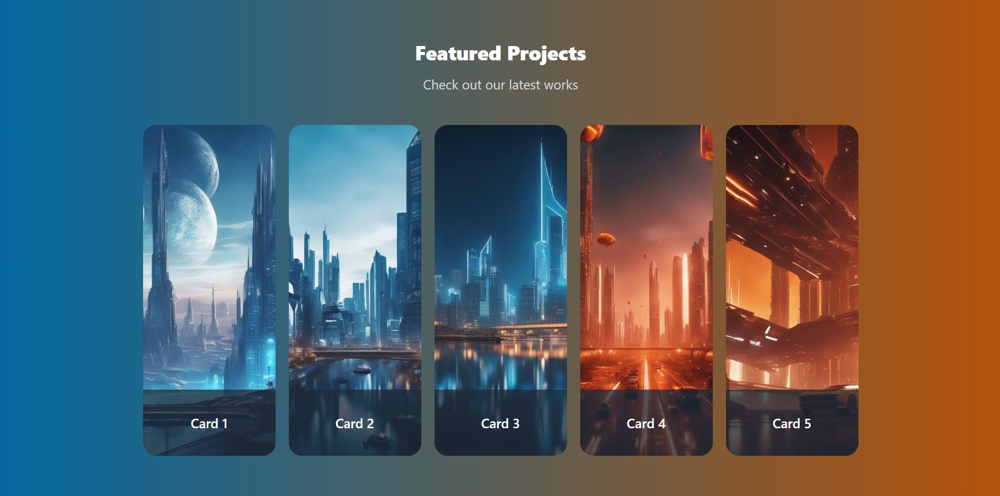

My Portfolio Next.js

## Visulation of the Website

## Description

Project aims get information about use to Framer Motion via a React, Tailwindcss

## Learning Outcomes

At the end of the this project, you will be able to;

- improve coding skills within ReactJS, Tailwindcss, Framer Motion.

- use git commands (push, pull, commit, add etc.) and Github as Version Control System.
# Getting Started with Create React App
